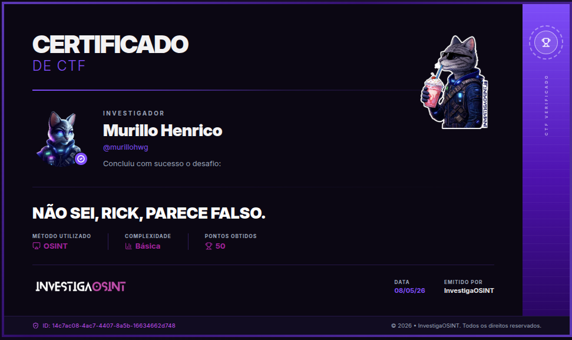

# Writeup — NÃO SEI, RICK, PARECE FALSO.



***

## Descrição do Desafio

Após um grave acidente ocorrido em **21 de janeiro de 2026** em **Gelida**, próximo de **Barcelona (Espanha)**, diversas imagens começaram a circular nas redes sociais, muitas delas manipuladas ou completamente falsas.

O objetivo do desafio era identificar o verdadeiro autor da fotografia original utilizada antes das manipulações.

Formato da flag:

```
FLAG{XXXX_XXXXX_XXXXX}
```

***

## Metodologia

O desafio era claramente voltado para **OSINT (Open Source Intelligence)**, então comecei investigando o acidente mencionado no enunciado.

Pesquisei por termos relacionados ao ocorrido:

```
Gelida Barcelona acidente 21 janeiro 2026
```

A partir disso, encontrei reportagens e documentos oficiais relacionados ao caso.

***

## Identificação do Autor

Durante a análise de um dos documentos encontrados, apareceu a menção de um possível responsável pelas imagens utilizadas na cobertura do acidente.

O nome identificado foi:

```
Joan Mateu Parra
```

Como o desafio envolvia imagens falsas e autoria original, decidi aprofundar a investigação sobre essa pessoa.

***

## Verificação e Pivoting

Pesquisando pelo nome encontrado, localizei o perfil profissional do fotógrafo no Instagram:

* Instagram: https://www.instagram.com/joanmateuparra/

O perfil continha informações relevantes:

* Fotojornalista freelancer;
* Atuação em Barcelona/Mallorca;
* Trabalho relacionado à fotografia jornalística.

Esses elementos reforçaram fortemente que ele era o autor legítimo da imagem original utilizada antes da disseminação das versões falsas/manipuladas.

***

## Flag

```
FLAG{JOAN_MATEU_PARRA}
```

***

## Técnicas Utilizadas

* OSINT
* Pesquisa em fontes abertas
* Correlação de informações
* Pivoting por nomes
* Verificação de identidade em redes sociais
* Análise contextual

***

## Considerações Finais

Este desafio demonstra como conteúdos virais podem facilmente perder sua atribuição original, especialmente em cenários de desinformação.

Mesmo uma investigação simples pode revelar a origem legítima de um conteúdo quando utilizamos:

* fontes confiáveis;
* validação cruzada;
* análise contextual;
* e técnicas básicas de OSINT.

***

## Certificado

O desafio foi concluído com sucesso na plataforma InvestigaOSINT.
