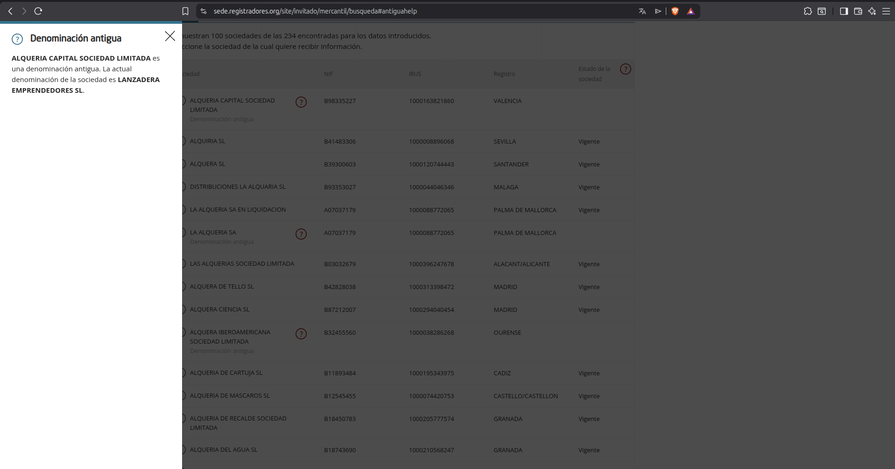
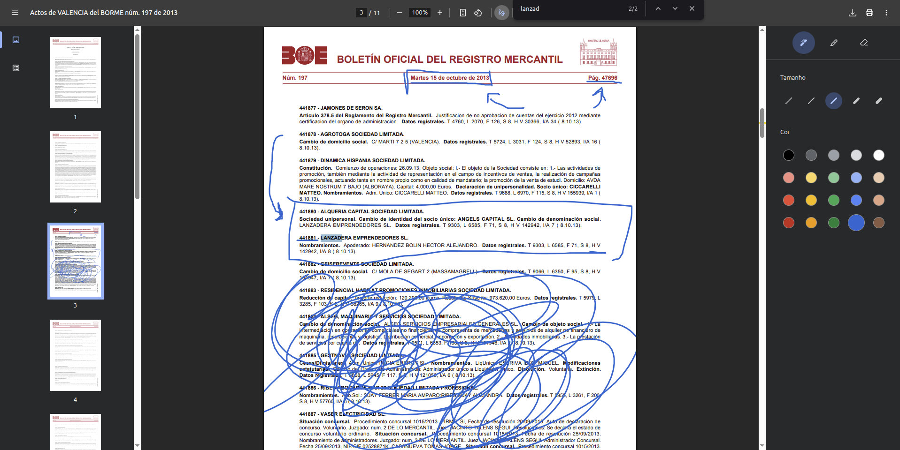

# Writeup: Operação de Rebranding do tipo "Hacendado


## Visão Geral

Este writeup documenta a resolução do desafio OSINT "Operação de Rebranding do tipo Hacendado", cujo objetivo foi identificar alterações societárias de uma empresa espanhola através de fontes públicas, com foco em registros mercantis.

O desafio exigiu análise detalhada de boletins oficiais, correlação de dados e investigação de mudanças de identidade empresarial (rebranding).

---

## Objetivo

Identificar:

- A nova denominação social da empresa
- O número do ato registral correspondente à alteração
- A página do boletim onde a alteração foi publicada
- Outros identificadores relacionados (formato de flags)

---

## Metodologia

A abordagem adotada seguiu os princípios clássicos de OSINT:

1. Coleta de dados em fontes públicas
2. Filtragem de informações relevantes
3. Correlação entre registros
4. Validação cruzada

---

## Etapa 1: Identificação da Empresa

Inicialmente, foi identificada a empresa:
```
ALQUERIA CAPITAL SOCIEDAD LIMITADA

```

Durante a investigação, foi observado que esta denominação estava marcada como **"denominación antigua"**, indicando que a empresa havia passado por um processo de rebranding.

---

## Etapa 2: Identificação da Nova Denominação

Utilizando a plataforma do Registro Mercantil da Espanha, foi possível verificar a mudança de nome da empresa.



Resultado:
LANZADERA EMPRENDEDORES SL


---

## Etapa 3: Consulta ao BORME

A próxima etapa consistiu em localizar o registro oficial da alteração no:

- Boletín Oficial del Registro Mercantil (BORME)

Após busca por atos relacionados à empresa, foi encontrado o seguinte registro:



441880 - ALQUERIA CAPITAL SOCIEDAD LIMITADA.
Sociedad unipersonal. Cambio de identidad del socio único: ANGELS CAPITAL SL.
Cambio de denominación social: LANZADERA EMPRENDEDORES SL.
Datos registrales: T 9303, L 6585, F 71, S 8, H V 142942, I/A 7 ( 8.10.13)


---

## Etapa 4: Extração de Informações Relevantes

A partir do registro encontrado, foram extraídos os seguintes dados:

- Número do ato: `441880`
- Data: `08/10/2013`
- Nova denominação: `LANZADERA EMPRENDEDORES SL`
- Página do boletim: identificada no cabeçalho do documento como:
  - Página: `47682`

---

## Flags Obtidas

### Flag 1

Formato:
FLAG{XXXXXXXXX_XXXXXXXXXXXXX_SL}

Resposta:
FLAG{LANZADERA_EMPRENDEDORES_SL}


---

### Flag 2

Formato:
FLAG{XXX.XXX}

Resposta:
FLAG{441.881}

---

### Flag 3

Formato:
FLAG{XX.XXX}

Resposta:
FLAG{47.682}

---

## Ferramentas Utilizadas

- Registro Mercantil da Espanha
- BORME (Boletín Oficial del Registro Mercantil)
- Navegador web
- Técnicas manuais de OSINT

---

## Aprendizados

Este desafio reforçou conceitos importantes:

- Importância da análise de registros públicos
- Identificação de mudanças societárias (rebranding)
- Interpretação de dados do BORME
- Correlação entre diferentes fontes oficiais
- Atenção a detalhes em documentos legais

---

## Conclusão

O desafio demonstrou como informações aparentemente dispersas podem ser conectadas para revelar mudanças relevantes em estruturas empresariais.

A utilização de fontes abertas, como o BORME, é extremamente valiosa em investigações OSINT, especialmente em contextos corporativos e de due diligence.

---
