# Writeup — N0 S4n1ty 1
> Web Exploitation & Privilege Escalation (Unrestricted File Upload → RCE → Sudo Misconfiguration)

## Overview
A web-based CTF challenge in which an unrestricted file upload vulnerability allowed a malicious PHP web shell to be uploaded to the server, resulting in Remote Code Execution (RCE). Post-exploitation enumeration revealed a critical `sudo` misconfiguration that allowed full privilege escalation to `root`.
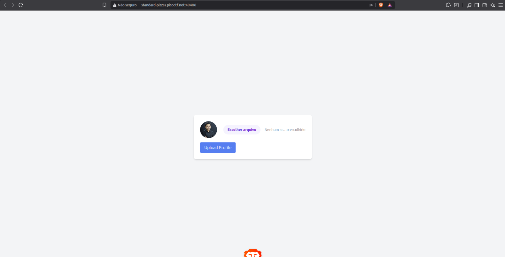
***

## Methodology
The application's file upload feature did not properly sanitize or restrict uploaded file types, allowing a PHP web shell to be uploaded and executed on the server. Initial attempts to directly read sensitive files were blocked due to insufficient file-system permissions for the web server process (`www-data`). Post-exploitation enumeration using `sudo -l` revealed a dangerously permissive sudoers configuration (`NOPASSWD: ALL`), which was leveraged to escalate privileges to `root` and retrieve the flag.
***

## Exploitation

### Step 1 — Homepage
**Method:** Accessing the provided challenge link\
**Location:** Homepage / login page\
**Finding:** Initial reconnaissance of the application's structure and available features, including the file upload functionality.

***

### Step 2 — Initial Access Attempt to /root
**Method:** Uploaded a PHP file crafted to directly `cat` the contents of the `/root` directory\
**Location:** `/root`\
**Finding:** Direct access to the `/root` directory was attempted and denied, indicating that a more privileged foothold on the server would be required.

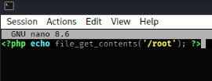
***

### Step 3 — Web Shell Upload
**Method:** Exploiting the unrestricted file upload functionality to upload a PHP web shell (`.php` file), bypassing insufficient file-type validation\
**Location:** File upload feature\
**Finding:** The PHP file was successfully uploaded and became accessible on the server, granting Remote Code Execution (RCE) in the context of the web server process.
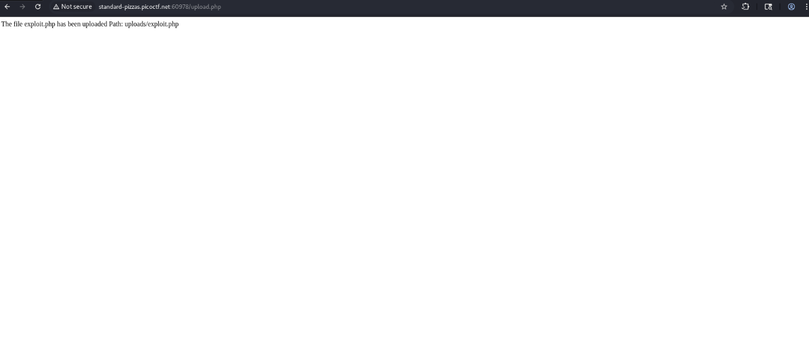
***

### Step 4 — Permission Denied on /root
**Method:** Using the uploaded web shell to call `file_get_contents()` targeting files inside `/root`\
**Location:** `/root` directory\
**Finding:** The request returned `Permission denied`, confirming that the `www-data` process did not have sufficient privileges to read root-owned files directly — a privilege escalation vector would be needed.
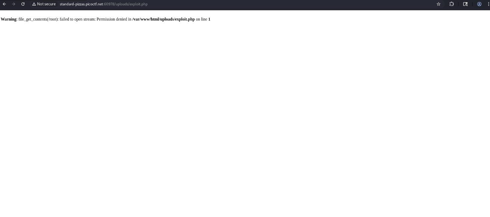
***

### Step 5 — Polyglot Upload Attempt (ExifTool)
**Method:** Tested an alternative upload bypass technique by crafting a polyglot file (image + embedded PHP payload) using ExifTool\
**Location:** `/uploads`\
**Finding:** The page returned the same result as the previous attempts, with no additional access gained — the direct PHP upload from Step 3 remained the working vector.

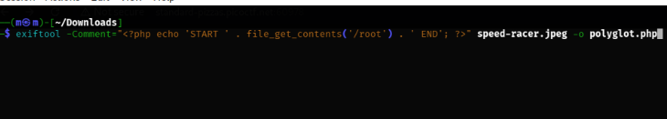
***

### Step 6 — Sudo Privilege Enumeration
**Method:** Executing `sudo -l` through the web shell to enumerate `sudo` privileges available to `www-data`\
**Location:** Web shell (RCE context)\
**Found:**
```
User www-data may run the following commands on challenge:
    (ALL) NOPASSWD: ALL
```
**Observation:** The `www-data` user was permitted to run **any command as any user, without a password** — a critical misconfiguration enabling trivial privilege escalation to `root`.

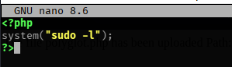
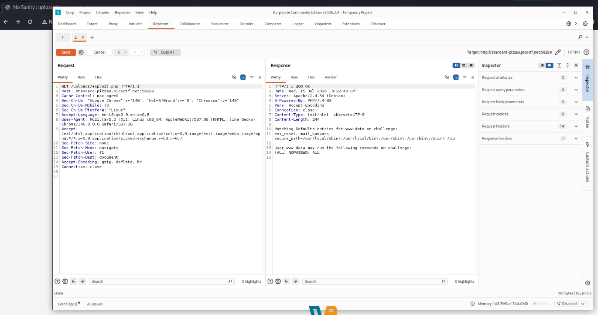
***

### Step 7 — Listing /root with Elevated Privileges
**Method:** Using `sudo ls /root` through the web shell to leverage the `NOPASSWD: ALL` misconfiguration\
**Location:** `/root` directory\
**Found:** Directory contents of `/root`, including the flag file.

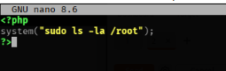
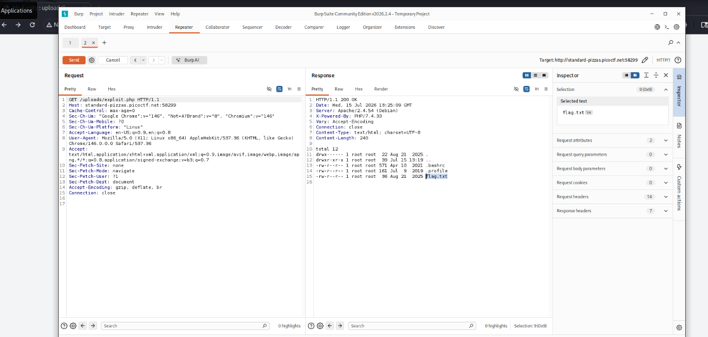
***

### Step 8 — Reading the Flag
**Method:** Using `sudo cat` through the web shell to read the flag file with root privileges\
**Location:** `/root/flag.txt`\
**Found:** The flag was successfully retrieved.

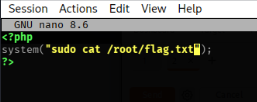
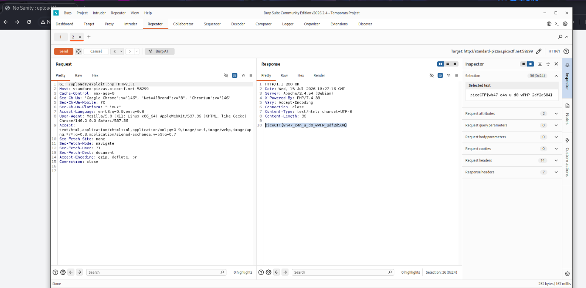
***

## Completed Flag
**`picoCTF{wh47_c4n_u_d0_wPHP_2df2d584}`**
***

## Tools Used
* Web application file upload feature (exploited for RCE)
* PHP web shell — arbitrary command execution
* Exiftool
* `sudo -l` — privilege enumeration
* Browser DevTools / direct GET requests to the web shell

## Concepts
* Unrestricted file upload vulnerabilities can lead directly to Remote Code Execution when file type/extension validation is missing or insufficient
* Gaining RCE does not always mean immediate root access — file-system permissions on the web server process must still be enumerated
* `sudo -l` is a fundamental post-exploitation step to identify privilege escalation paths
* A `NOPASSWD: ALL` sudoers entry for a service account (like `www-data`) is a critical misconfiguration, effectively granting full root access to anyone who compromises that service
* Privilege escalation chains often combine an initial low-privilege foothold (RCE) with a misconfiguration (sudo, SUID binaries, cron jobs, etc.) to reach root
