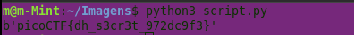

# writeup

  

## WriteUp - Shared Secrets (picoCTF)

> Diffie-Hellman XOR Leak

***

### Challenge Overview

This challenge combines a simplified Diffie-Hellman key exchange with XOR encryption.

The application generates public parameters, computes a shared secret, and encrypts the flag using a single-byte XOR key derived from the shared secret.

At first glance, the huge numbers may seem intimidating, but the vulnerability becomes obvious after inspecting the generated output carefully.

***

### Initial Analysis

The provided Python script performs the following operations:


The challenge uses:

* Diffie-Hellman key exchange.
* A shared secret.
* XOR encryption using a single-byte key.

The encrypted flag is generated with:

```python
enc = bytes([x ^ (shared % 256) for x in flag])
```

This means every byte of the flag is XORed using:

```python
shared % 256
```

### Inspecting the Provided Message

The challenge also provides a `message.txt` file containing:


At this point, the critical vulnerability becomes obvious: the private exponent `b` is directly leaked.

In a proper Diffie-Hellman exchange:

* `a` must remain secret.
* `b` must remain secret.

However, this challenge exposes `b` directly inside the output file.

Because of this, we can fully reconstruct the shared secret without solving any difficult mathematical problem.

### Identifying the Vulnerability

The shared secret is computed as:

```python
shared = pow(A, b, p)
```

Since we already know:

* `A`
* `b`
* `p`

we can simply recompute the shared secret ourselves.

The encryption key is then:

```python
key = shared % 256
```

Since XOR is reversible:

```python
plaintext = ciphertext ^ key
```

we can directly recover the original flag.

### Exploit Development


The script recomputes the shared key and reverses the XOR encryption.

### Recovering the Flag

Running the exploit successfully reveals the original flag.



### Flag Submission

After recovering the flag, it was submitted successfully on the picoCTF platform.


This confirmed that the exploit and key reconstruction process were correct.

### Lessons Learned

* Diffie-Hellman security depends entirely on keeping private exponents secret.
* Leaking a private key completely breaks the exchange.
* XOR encryption with a single-byte key is extremely weak.
* Encoding formats like hexadecimal are not encryption.
* Large numbers alone do not guarantee security.

Even though the challenge used massive cryptographic values, a simple implementation mistake completely compromised the system.
