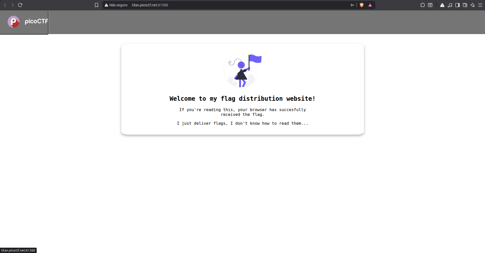
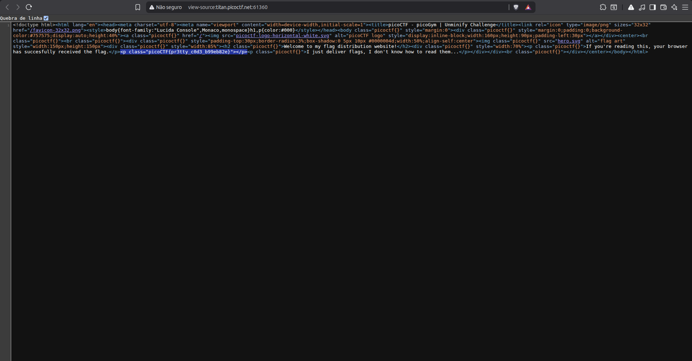

# WriteUp - unminify
> Web Exploitation

### Description

> I don't like scrolling down to read the code of my website, so I've squished it. As a bonus, my pages load faster!
>
> Browse here, and find the flag!

---

## Objective

Find the hidden flag on the website.

---

## Analysis

Upon opening the challenge website, only a simple webpage was displayed.



Since this was a Web Exploitation challenge and the description mentioned that the website code had been "squished" (minified), the first step was to inspect the page source.

Using the browser's **View Page Source** feature (`CTRL + U`), the HTML source code became visible.

While reviewing the source code, the flag was immediately found inside an HTML class attribute.



---

## Flag

```text
picoCTF{***************}
```

---

## Root Cause

The flag was directly exposed in the client-side source code of the webpage.

Although the HTML had been minified to reduce its size, minification does not provide any security benefits. All content sent to the browser remains accessible to the user and can be inspected through browser developer tools or by viewing the page source.

---

## Concepts

* Minification reduces file size but does not hide sensitive information.
* Anything delivered to the client should be considered public.
* Browser tools such as **View Source** and **Developer Tools** are essential when analyzing web challenges.
* Sensitive information should never be embedded directly in client-side code.

---

## Techniques Used

* Source Code Review
* HTML Inspection
* Browser Developer Tools

---
