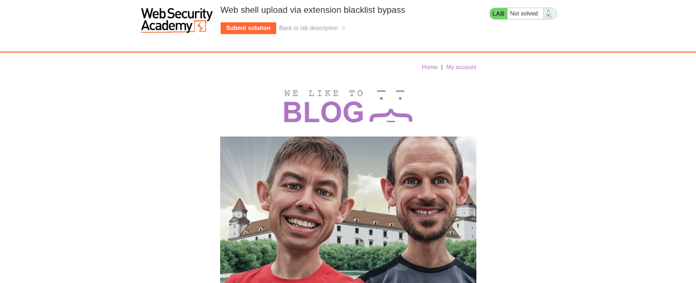
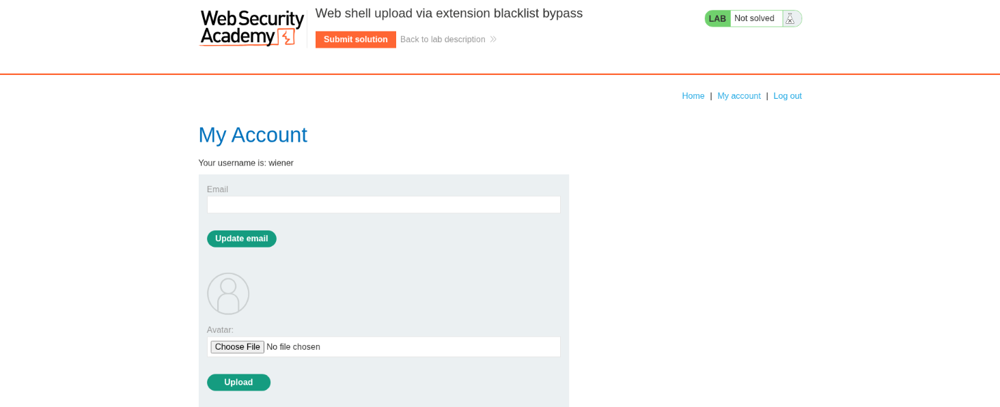
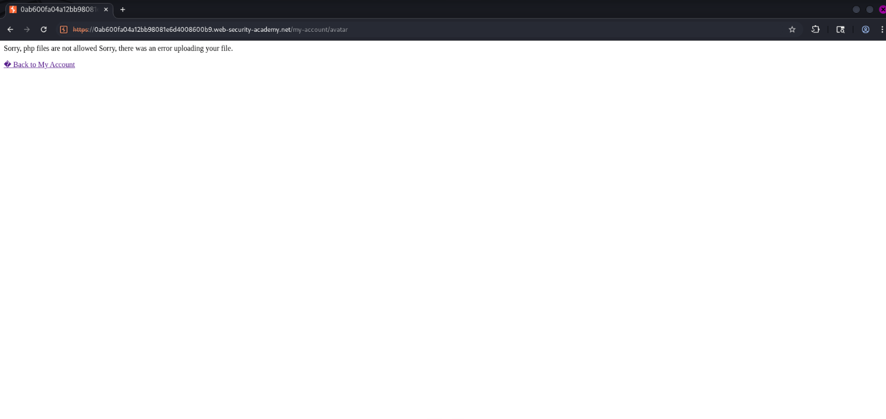
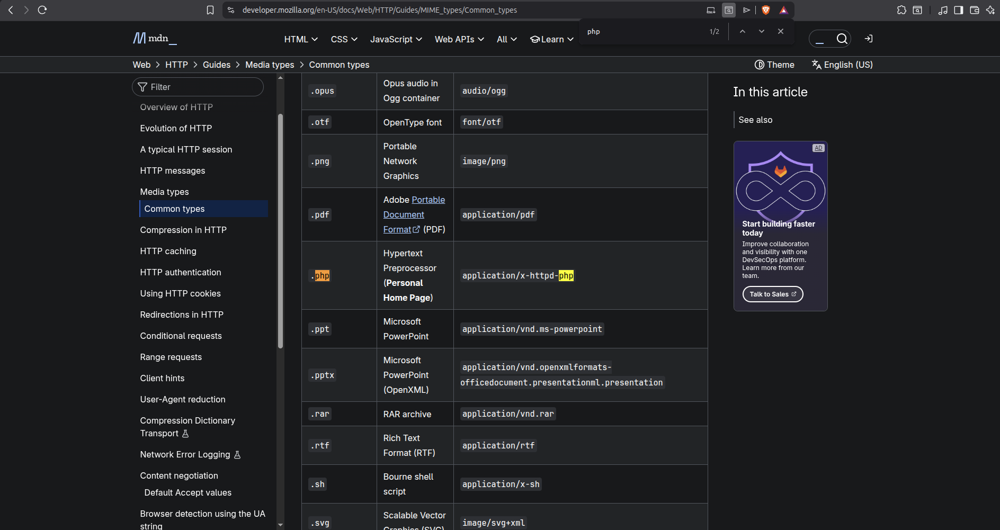
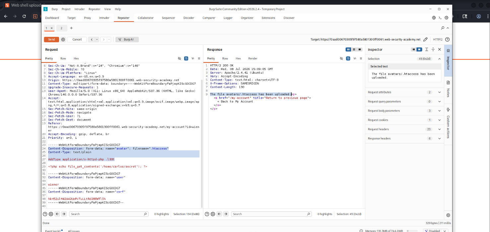
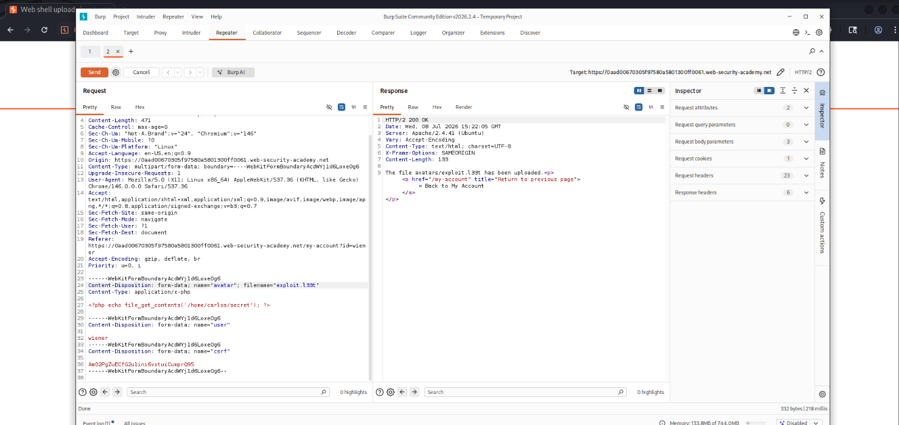
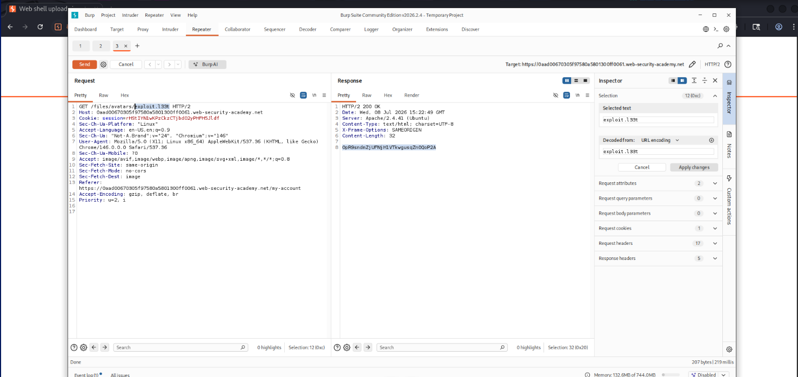

# Writeup — Remote Code Execution via Web Shell Upload
> Web Exploitation & File Upload Vulnerabilities (Apache MIME Type Misconfiguration)

## Overview

A PortSwigger Web Security Academy lab focused on exploiting a file upload vulnerability to achieve remote code execution (RCE) on an Apache server. The application blocked uploads with a `.php` extension, but this restriction could be bypassed by abusing Apache's `.htaccess` configuration to map an arbitrary file extension to the PHP handler.



***

## Methodology

The application allowed authenticated users to upload an avatar image, which was later served via a predictable path (`/files/avatars/<FILENAME>`). By intercepting the upload request in Burp Suite, it was possible to identify that direct uploads of `.php` files were blocked by an extension blacklist. However, the server's response headers revealed it was running Apache with `mod_php` enabled. This allowed a two-step bypass: first uploading a malicious `.htaccess` file that mapped a custom extension (`.l33t`) to the PHP handler, and then uploading the actual payload using that extension to evade the blacklist entirely.

***

## Exploitation

### Step 1 — Reconnaissance and Baseline Upload

**Method:** Logging in and navigating to the account page to identify the avatar upload feature\
**Location:** My Account page\
**Finding:** The application allows avatar image uploads, later served from `/files/avatars/<FILENAME>`.



***

### Step 2 — Attempting Direct PHP Upload

**Method:** Crafting a malicious PHP file (`exploit.php`) containing:
```php
<?php echo file_get_contents('/home/carlos/secret'); ?>
```
and attempting to upload it as the avatar\
**Location:** POST `/my-account/avatar`\
**Finding:** The upload was rejected — the application explicitly blocks files with a `.php` extension.



***

### Step 3 — Identifying the Server Stack

**Method:** Inspecting the response headers of the blocked `POST /my-account/avatar` request in Burp Proxy history\
**Location:** HTTP response headers\
**Finding:** The `Server` header revealed the backend was running **Apache**, which supports per-directory configuration overrides via `.htaccess` files — a strong indicator that a MIME-type remapping bypass could be viable.



***

### Step 4 — Uploading a Malicious .htaccess File

**Method:** In Burp Repeater, modifying the `POST /my-account/avatar` request:
- Changed the `filename` parameter to `.htaccess`
- Changed the `Content-Type` header to `text/plain`
- Replaced the file body with the Apache directive:
```apache
AddType application/x-httpd-php .l33t
```
**Location:** Multipart body of the avatar upload request\
**Finding:** The `.htaccess` file was accepted and uploaded successfully, since it does not carry a blocked extension. Because the server uses `mod_php`, any file with the `.l33t` extension in that directory would now be executed as PHP.

***

### Step 5 — Bypassing the Extension Blacklist

**Method:** Returning to the original PHP payload upload request and renaming the `filename` parameter from `exploit.php` to `exploit.l33t`\
**Location:** POST `/my-account/avatar`\
**Finding:** The upload succeeded — `.l33t` is not on the blacklist, and the malicious `.htaccess` file now instructs Apache to treat it as executable PHP.





***

### Step 6 — Triggering the Web Shell

**Method:** Sending a `GET` request to `/files/avatars/exploit.l33t`\
**Location:** GET `/files/avatars/exploit.l33t`\
**Finding:** The server executed the file as PHP, returning the contents of `/home/carlos/secret` in the HTTP response.



***

## Completed Flag

**OpR9sndnZjUFNjH1VTkwgusqZn0QoP2A**

***

## Tools Used

* Burp Suite (Proxy, Repeater) — request interception and manipulation
* Apache `.htaccess` MIME-type remapping (`AddType`)
* PHP web shell (`file_get_contents`)

## Concepts

* Blacklist-based file extension filters are inherently bypassable when server-specific configuration files (like `.htaccess`) can also be uploaded
* Identifying the underlying web server (via response headers) is critical before choosing an extension-bypass technique
* Apache's `AddType` directive can remap arbitrary extensions to executable handlers, defeating naive extension checks
* Always test whether configuration files themselves (`.htaccess`, `web.config`) can be uploaded — they are often overlooked by blacklists
* Chaining two uploads (config file + payload) is a common pattern to defeat single-layer file upload defenses
